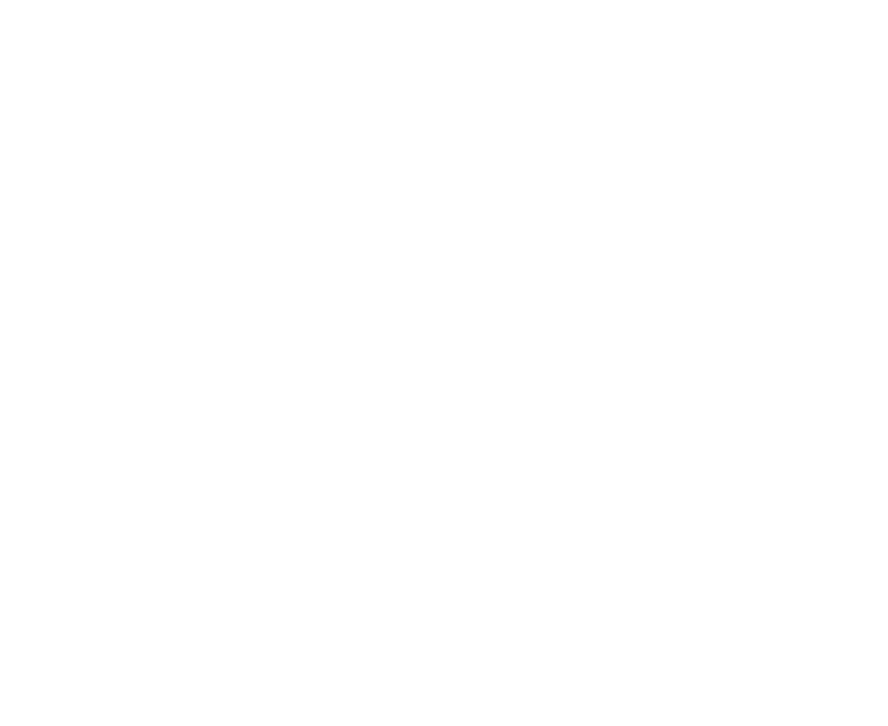

# DailyFrame - Warframe Dailies, Weeklies, Monthlies Task Checklist

## Features
* List of daily and weekly repeatable tasks for Warframe
* Click the red area in right column (incomplete) to switch to green (completed)
* Brief comments on the benefits of completing the task
* Links to warframe wiki or other relevant pages with further info
* Automatic countdown timer til the next reset time
* Once the reset time has past, completed tasks are automatically reset for you
* Saves what you checked off in the right column across visits in your browser's localStorage
* Drag and drop reordering (on desktop) that's saved so you can move the stuff you find more important to the top
* Links in nav to "more resources" that might be useful for gameplay information
* Allows hiding of tasks and sections and saves preference in localStorage
* Compact view mode
* Multiple profile capability
* Ad free / tracking free

## Requests

Please submit any missing tasks, bugs or new feature requests to the [issue tracker](https://github.com/dailyframe/dailyframe.github.io/issues).

Warframe® is a registered trademark of Digital Extremes ©2024 Digital Extremes Ltd.
